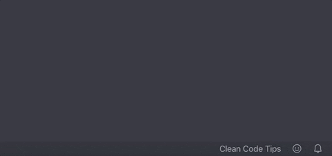

# Displays a clean code tip each time you open VSCode to help us all become better engineers!

## What the tips look like!

## Configurable time between tips!

## Author

### - [Chris Wingler](https://chriswingler.github.io/)

## Planned features
- Add testing tips
- Add testing tips to settings page
- Language translations
- Support for other editors

## [Github repository](https://github.com/chriswingler/clean-code-tips)

## Attributions

- Tips written by Urs Enzler [here.](https://www.planetgeek.ch/wp-content/uploads/2014/11/Clean-Code-V2.4.pdf) (PDF)

- Data gathered by fritzmark [here.](https://github.com/fritzmark/CleanCodeCheatSheetJson)